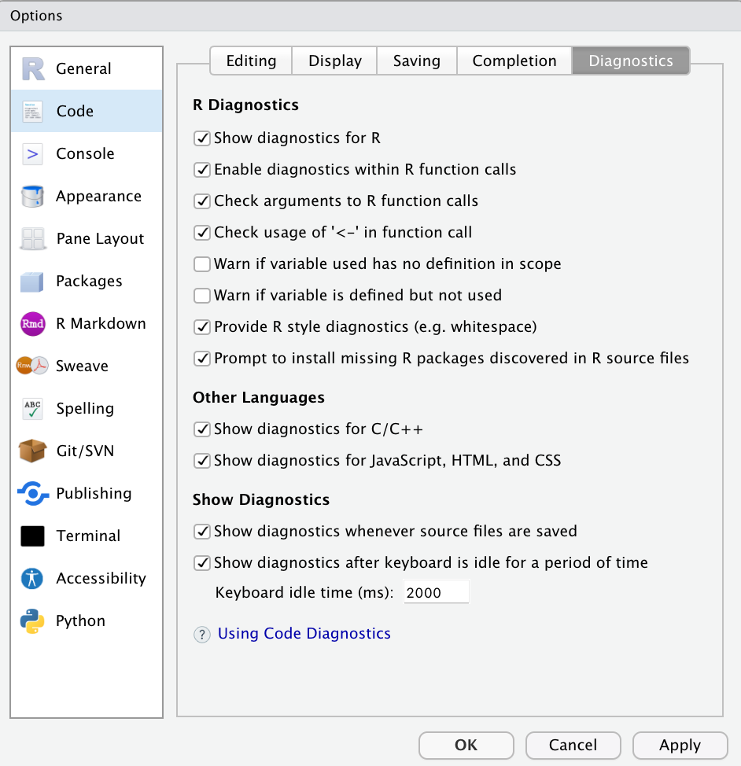
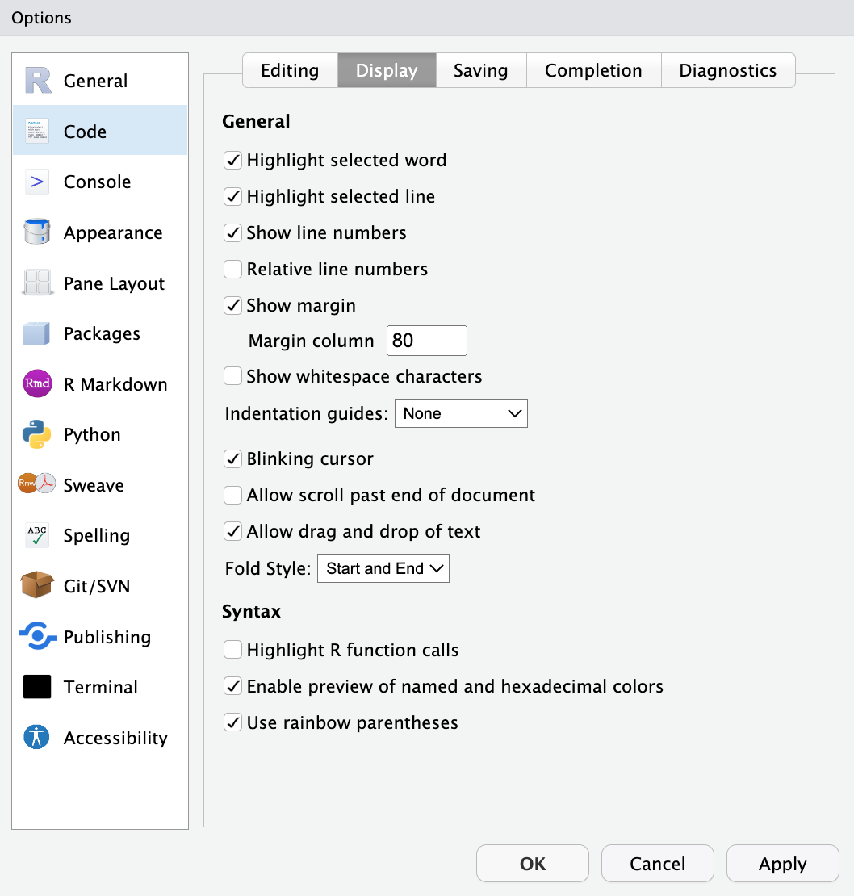

```{r include=FALSE}
# Frontmatter
rm(list = ls())      # prevents common errors

library(mosaic)
library(tidyverse)
library(dcData)

data("BabyNames")
```
## Packages + Tidyverse
- You only need to install a package once (on every machine you're on)
```{r}
install.packages("tidyverse")

## every time you want to use a function inside a package, you need to load the library
library(tidyverse) #now we can use the tidyverse functions! 
```
- Before we get into functions in the tidyverse, we will introduce one more special operator in R
- The tidyverse package contains the `%>%`  (pipe) operator 
- Pipe takes what ever is before the `%>%` and inputs as the first element into whatever is after the `%>%`.

## An example using the mean function
```{r}
?mean 
numbers <- c(1,5,6,8,23,45,67)
```
-The following are equivalent 
- Method 1 
```{r}
mean(numbers)
```
- Method 2
```{r}
numbers %>%
  mean()
```
- Pipe is usually used when we have a series of operations we want to compute
- Lets use the iris data set as an example 
```{r}
iris
```
- Say I want to arrange the rows in this data set by the Sepal.Length. 
- The following are equivalent
- Method 1
```{r}
arrange(iris, Sepal.Length)
```
- Method 2
```{r}
iris %>%
  arrange(Sepal.Length)
```
- But now say we only want to keep rows with Sepal.Width > 3 AND arrange the table by Sepal.Length
- The following are equivalent 
- Method 1
```{r}
temp1 <- arrange(iris, Sepal.Length)
result <- filter(temp1, Sepal.Width > 3)
result 
```
- Method 2
```{r}
iris %>%
  arrange(Sepal.Length) %>%
  filter(Sepal.Width > 3)
```
- Both methods technically work, but method 2 is must easier to read and took a lot less typing! 
- (advanced) Method 2 takes up significantly less memory on your machine than Method 1. This is one of the primary reasons we use `%>%`.

## Additional resources about tidyverse opeartions
- You can learn about additional dplyr functions (dplyr is a smaller package that is automatically loaded if the tidyverse package is loaded) at <https://dplyr.tidyverse.org/articles/dplyr.html>.
- NOTE: a tibble is similar to a dataframe, and you can operate on it as if it is a dataframe.
- Fun example to work on: <>

## Thematic Statement 

#### Chapter 3 Intro: 

> Almost everyone who writes computer commands starts by copying and modifying existing commands. 

> To do this, you need to be able to **read** command expressions.  

> Once you can read, you will know enough to identify the patterns you need for any given task and consider what needs to be modified to suit your particular purpose.


## R Command Patterns: Command Chains

```{r, eval=FALSE}
Princes <- 
  BabyNames %>%
  filter(name == "Prince") %>%
  group_by(year, sex) %>%
  summarise(yearlyTotal = sum(count))
```
- Each link in the chain will be a data verb and its arguments.
  - The very first link is usually a data table.
  - Put each link on its own line in general
- Links are connected by the pipe: `%>%` 
- Often, but not always, you will save the output of the chain in a named object.
  - This is done with the *assignment operator*, `<-`

- Note that `%>%` is at the end of each line.
  - Except ... `Princes <-` is assignment
  - Except ... The last line has no `%>%`.
    

**We'll be using the chain syntax for most things in STAT 184**.  You should know that anything written with chain syntax can be written without, and lots of things written without can be converted to chain syntax.      


## Parts of Speech in R

1. Data frames
    - tidy data for one or more variables 
    - Data frames often appear at the start of a command chain.
    - If assignment is used to save the result, the object created is usually a data frame. 
    - Convention: data table names should start with a CAPITAL LETTER, e.g., `RegisteredVoters` 

2. Functions
    - Functions are objects (i.e. *data verbs*) that transform an input into an output.
    - Functions are **always** followed by parentheses, that is, an opening  `(` and, eventually, a closing `)`.
    - Each link in a command chain starts with a function.

3. Arguments
    - Arguments describe the details of what a function is to do. 
    - They go **inside** a function's parentheses.  
    - Multiple arguments are **always** separated by commas.
    - Many functions take *named arguments* which look like a name followed by an `=` sign, e.g. 
    - Technical note: the data frame passed by `%>%` is by default used as the first argument to the function that immediately follows.

```{r}
data(package = "dcData")
```

4. Variables
    - Variables are the components (columns) of tidy data tables.
    - When they are used, they usually appear in function arguments, that is, between the function's parentheses.
    - Variables will **never** be followed by `(`.
    - Convention: variables should have names that start with a lower-case letter (*not* universally followed).

5. Constants
    - Constants are single values, most commonly a number or a character string. 
    - Character strings will always be in quotation marks,     
       `"like this."`  
    - Numerals are the written form of numbers, for instance.    
        `-42`  
        `1984`  
        `3.14159`  

### Additional Remarks

6. Assignment
    - stores the output of the command (chain) in a named object.
    - Use the *assignment operator*, `<-` (it looks like an arrow pointing to the object) 

7. Formulas
    - common argument to many functions
    - `regressionModel <- lm(Y ~ X, data = ProjectData)`
        - The `Y ~ X` part is a formula
        - What other parts do you see?
    - mostly left to other statistics classes  


## Discussion Problem

Consider this command chain:

```{r eval=FALSE}
Princes <- 
  BabyNames %>% 
  filter(grepl("Prince", name)) %>% 
  group_by(year) %>% 
  summarise(total = sum(count))
```

Just from the syntax, you should be able to discern the role of each of these things: 

- `Princes` 
- `BabyNames` 
- `filter` 
- `grepl` 
- `"Prince"` 
- `name` 
- `group_by` 
- `year` 
- `summarise` 
- `total` 
- `sum` 
- `count`


## Conventions (i.e. Style)

- It's important to note that these conventions are for the benefit of users & consumers of your code. 
- **R will not "enforce" them for you** (but RStudio can help...more in a moment)


### Popular conventions:

- whitespace, comments, long lines
    - be generous with whitespace (R just ignores it, and it makes code MUCH easier for humans to read)
    - Use the `#` character to include comments within code chunks (again be generous; R ignores comments)
    - limit length of R commands to about 80 characters

- object assignment & naming
    - use `<-` for assignment (not "=")
    - data tables should begin with a CAPITAL letter 
    - variables should begin with a lowercase letter.  
    - use descriptive but concise object names (harder than it sounds, but totally worth it)
    - camel-case or "_" syntax (i.e, `variableName`; `variable_name`; `DataTableName`)


### Style Guides

There are several published style guides to help R programmers write beautiful code.  

- [Data Computing eBook by Kaplan & Beckman (see Appendix: R Programming Style Guide)](https://dtkaplan.github.io/DataComputingEbook)
- [Tidyverse Style Guide by H. Wickham](https://style.tidyverse.org/)
- [Google's R Style Guide (allegedly)](http://web.stanford.edu/class/cs109l/unrestricted/resources/google-style.html)


## RStudio Help with Style (part 1)

RStudio has some basic support built in (required for STAT 184), but more comprehensive support is provided by the `lintr` package (recommended).

**RStudio >> Tools >> Global Options >> Code >> Diagnostics >> check nearly all boxes (both "warn if variable..." settings can be optional)** 



## RStudio Help with Style (part 2)

**Global Options >> Code >> Display >> (show line numbers; set margin = 80; rainbow parenthesis; others optional)**




## RStudio Help with Style (part 3)

Once configured, when RStudio detects styling errors:

- a blue "information" dot appears in in the margin
- hover your cursor on the "information" dot for a description of each error
- a wavy blue underline appears under the error (though hard to see)


## Markdown / R Markdown

- Human-readable syntax by design
- The same `.Rmd` can be "rendered" in any of several formats (HTML, PDF, and more)
- Can produce both slides, documents, webpage, etc as output.
- **Regardless** of intended output, Rmd documents generally require two parts
    - "yaml" header at the top (designated by `---` before/after) includes some document controls
        - title
        - author
        - date
        - output
        - [and more...]
    - body of the document is made of various combinations of components such as:  
        - Markdown syntax (like hashtag headers)
        - Narrative text... regular sentences and paragraphs
        - Lists (bullets or numbers)
        - R Code "chunks"
        - URLs
        - Images
        - Tables
        - and more...


## Using R Notebooks for STAT 184:   

- All assignments in STAT 184 should be submitted as **R Notebook**, unless instructed otherwise
- Example header for Rmd file to produce an R Notebook  
    - **Important** to notice `output: html_notebook` 
    - That can get changed on accident, and students get confused

````
---
title: "Assignment Title"
author: "Your Name Here"
date: "Due Date Here"
output: html_notebook
---
````


- RStudio >> File >> New File >> R Notebook
    - For all intents & purposes it just makes a fancy HTML document 
    - RStudio automatically adds the extension ".nb.html" to let you know
    - Resulting document embeds a "Code" button in top right that allows readers to download Rmd
    - You must run all R code in your Rmd document before it can appear in the HTML R Notebook 
- Generally, you will upload your **HTML** file to Canvas... R Notebook will embed your `.Rmd` automatically
- If your R Notebook won't work for some reason, you can usually submit the `.Rmd` file for a penalty

Tip: The people at Posit publish RStudio "Cheat Sheets" can help you get off and running with these tools.  [Here's a link to several of them](https://posit.co/resources/cheatsheets/), including R Markdown, RStudio, and other topics we'll hit in this course.  


## Git / GitHub

- [See Chapter 9 in Data Computing eBook (link)](https://dtkaplan.github.io/DataComputingEbook/chap-version-control.html#chap:version-control) 
- "GitHub is a code hosting platform for version control and collaboration. It lets you and others work together on projects from anywhere." 
- **Repositories ("Repos")** are used to organize each project
    - These can contain documents, images, folders, code, data, ... basically everything you need for your project 
    - "Larger" files (> 100 MB) need some special handling
    - We'll link each **GitHub Repository** to an **RStudio Project** (in a normal directory folder on your computer)
    - Pro Tip: Don't put repositories *inside* other repositories
- Most of your workflow is unchanged!
    - As far as your computer is concerned, the repository works just like any other directory (i.e. folder)
    - You edit files, save changes, etc


## Git / GitHub


- **commit** changes
    - ideally, each commit should encompass *one meaningful modification* 
    - creates a permanent snapshot of the repository
    - you can revisit these snapshots at any time... 
- **push/pull** to remote
    - GitHub stores the state of your repository in the cloud
    - When you *push*, you update the remote version 
    - Anyone with access to your GitHub repository can *pull* the remote version and work with it
        - This might be you, using a different computer (like the RStudio Server)
        - It might be a collaborator like your STAT 184 paired programming teammate
        - It might be a professor or TA
        - If the repo is made public, it might be a complete stranger!
    - The collaborator can then commit changes and push them to the remote as well 


## Merge Conflicts

- Rare for single-user Repos unless you're contributing from multiple computers
- Git is good about merging changes from different collaborators as long as they stay out of each other's way
- a **merge conflict** occurs when collaborators make changes that are in direct conflict with one another (e.g., different versions of the same line(s) in the same document)
    - this is actually a very good thing because Git doesn't just overwrite changes of one user (that could be really bad)
    - Git instead lets a human decide which version of the work should ultimately be kept or removed in order to reconcile the apparent conflict

## "Cloning" and "Forking"
- You can clone repos that you yourself own. We actually cloned the Test-Repo onto our local computer when we created a new project with the "Version control" and "Git" options.
- When you do not own repositories that you want to copy/download onto local computer and make changes to it, you need to "fork" the original repository to create a repository of your own.

## Git / GitHub

- Once configured, nearly all of the action can happen in RStudio (or RStudio Server)
- A "Git" tab will appear in RStudio
- Diff, Commit, Pull, Push are most common actions

## GitHub & RStudio (for STAT 184 assignments!)

- assignments are often deployed to you as Git Repos (hosted on GitHub)
- See DataComputing eBook for screenshots to import them into RStudio
    - [eBook appendix (link)](https://dtkaplan.github.io/DataComputingEbook/appendix-github-rstudio-configuration.html#appendix-github-rstudio-configuration)
    - For assignments, when I've given you a template Repo (i.e., a link deployed from Canvas)
    - You'll start from section "18.23 In GitHub..." at Step 3 in the Data Computing eBook
    
## Assignments before next lecture (July 10)
- GitHub Practice Assignment 
- DataComputing Ebook Chapter 2 and 3 Exercises () 